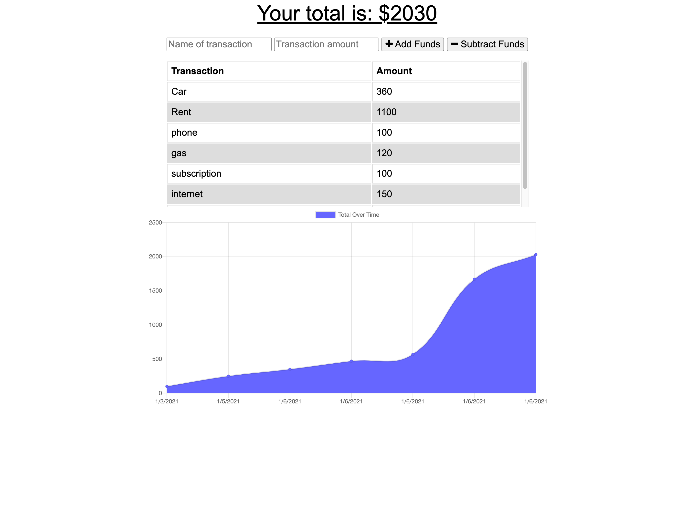

# budget-tracker
This is a (PWA) budget tracking application. The user will be able to add expenses and deposits to their budget with or without a Internet connection. When entering transactions offline, they should populate the total when brought back online.

---
 

### Table of Contents
- [Screen Shots](#screen-shots)
- [User Story](#user-story)
- [Business Context](#business-context)
- [Technologies](#technologies)
- [References](#references)
- [License](#license)
- [Author Info](#author-info)

---
 

### Screen Shots

### User Story
AS AN avid traveller
I WANT to be able to track my withdrawals and deposits with or without a data/internet connection
SO THAT my account balance is accurate when I am traveling

---
 

### Business Context

Giving users a fast and easy way to track their money is important, but allowing them to access that information anytime is even more important. Having offline functionality is paramount to our applications success.

---
 

### Technologies
- HTML5
- CSS3
- Javascript
- chart
- Node.js
- Express
- Mongodb
- Mongooes
- MVC
- IndexedDB
- Service-worker
- webmanifest
- caches

---
 
### References

- w3school -- [Node.js NPM](https://www.w3schools.com/nodejs/nodejs_npm.asp)
- NPM -- [Node Package Managment](https://www.npmjs.com/)
- Node.js -- [About Node.js](https://nodejs.org/en/)
- json -- [The package.json guide](https://nodejs.dev/learn/the-package-json-guide)
- Mongodb -- [Mongodb](https://docs.mongodb.com/manual/reference/resource-document/)
- Express -- [express module](https://www.npmjs.com/package/express)
- MDN -- [MDN](https://developer.mozilla.org/en-US/)

[Back To The Top](#Workout-Tracker)

---
 

### License

---
 

### Author Info

- Linkedin -- [Amit Karmacharya](https://www.linkedin.com/in/amit-karmacharya-b344731ab/)
